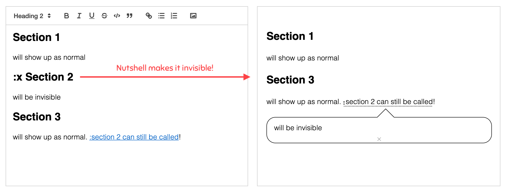

# Nutshell: make expandable explanations


**[Check out the demo here!](https://ncase.me/nutshell)**

**Readme's Table of Contents:**

* [There will be no version 2.0.0](https://github.com/ncase/nutshell#there-will-be-no-version-200) (Why Nutshell is minimalist, contributions I accept, _possible_ future tweaks)
* [Advanced features & options](https://github.com/ncase/nutshell#advanced-features--options) (Documentation)

## There will be no Version 2.0.0

> “Running a successful open source project is just Good Will Hunting in reverse, where you start out as a respected genius and end up being a janitor who gets into fights.”
>
> ~ [Byrne Hobart](https://www.thediff.co/p/working-in-public-and-the-economics)

*Nutshell* is open-source ([Creative Commons Zero](https://creativecommons.org/publicdomain/zero/1.0/)), but this is *not* a "I will take requests & maintain this for the rest of my pathetic life" kind of project. I am pre-committing, right here, to keeping Nutshell minimalist, and only making minor tweaks. There will be no Version 2.0.0 of Nutshell.

That said, I'm accepting two kinds of Pull Requests! **1) Bug fixes, and 2) Translations**.

Bug fixes are self-explanatory. Translations are slightly harder.

### On translating:

In the `nutshell.js` file, there's a JSON object containing all of Nutshell's English text:

```
Nutshell.language = {
	en: {

		// Button text
		closeAllNutshells: `close all nutshells`,

		// Nutshell errors...
		notFoundError: `Uh oh, the page was not found! Double check the link:`,
		wikiError: `Uh oh, Wikipedia's not loading, or the link is broken. Please double check:`,

[and so on...]

```

To help translate Nutshell:

1. Copy the "en" object
2. Add a new object to `Nutshell.language` with [the 2-letter code for your target language](https://en.wikipedia.org/wiki/List_of_ISO_639-1_codes)
3. Translate everything (~150 words) in backtick-quotes (but leave alone the stuff inside `[square brackets]` or `<angular brackets>`!!!)
4. Send a Pull Request! 🎉
5. Give me two weeks to slog through my Sisyphean inbox & finally merge it.

Note: I'm only accepting translations for the Nutshell *library*, not the demo website.

I'm also *not* accepting Pull Requests for new features, but feel free to suggest some in the Issues tab, and emoji-upvote (👍) others' suggestions! *This will not determine what I make,* I'm just curious what y'all want. I am pre-committing: _I will only implement minor features \*I\* personally want_.

(If there's a feature you want but I don't, make a fork! Then post your fork in the corresponding Issue, so everyone who also wants that feature can use it, too.)

### Possible future shtuff

If you're curious, here's some minor features I *maybe MAYBE* might add:

* In-built support for:
	* Wiktionary
	* Vimeo
	* LaTeX?? (though, this may be bloat... maybe math blogs oughta install LaTeX-rendering separately.)
	* Direct image links (if URL ends in .png, .jpeg, etc, embed that image)
	* Embed specific Wikipedia sections, not just the intro paragraph
	* Allow "before" and "after" texts for Wiki/YouTube
	* Can write full content of a very short Nutshell right in the link. (good for "hint systems")
	* A general "plug-in" system so that 1) I don't have a giant if-elseif-elseif statement for handling Wikipedia/YouTube/Vimeo/Wiktionary/Images/etc, and 2) other folks can write their own plug-ins.
* Allowing _very limited_ styling of content in Nutshells. (the problem is to avoid cross-site vandalism that spills _outside_ of the bubble. So, maybe only `background`, `color`, `font-size`, and `float`?)
* An easy tool to make Nutshell links with advanced features, rather than making you go through the documentation & test it in the Try Nutshell demo
* [I DO NOT LIKE THIS IDEA, BUT AM LISTING IT COZ IT'LL BE REQUESTED A LOT]: Configuration option to show bubbles on hover, hide on mouse-out? (May suck for long, recursive nutshells. And mouse-out seems very fragile – move cursor 1px and whoops 3 layers of explanation vanish – plus, won't work on mobile anyway...)
* Put this on npm? For "serious developer" points.

## Advanced features & options

### Configuring Nutshell

After including Nutshell (e.g. where you put `<script src="nutshell.js"><script>`), you can optionally configure Nutshell by *immediately* calling `Nutshell.setOptions` afterwards, like so:

```
<script>
Nutshell.setOptions({
    startOnLoad: true, // Start Nutshell on load? (default: true)
    lang: 'en' // Language (default: 'en', which is English)
});
</script>
```

There are currently only 2 options:

**startOnLoad (default: true).** Set this to `false` if you *don't* want Nutshell to immediately run on page load. (e.g. if your article is asynchronously loaded). Later, to *actually* start Nutshell, call:

`Nutshell.start();`

By default, Nutshell tries to convert the whole page. To limit Nutshell to converting just a container/element, call:

`Nutshell.start(element);`

**lang (default: 'en').** If Nutshell supports your language, you can make Nutshell speak it by setting `lang` to your language's [two-letter code](https://en.wikipedia.org/wiki/List_of_ISO_639-1_codes). (Currently, Nutshell only supports English, but there'll be more fan-translations soon! If you're comfortable with programming/Github, see [how you can help translate it](https://github.com/ncase/nutshell#on-translating))

**Want to change Nutshell's style?** Just put CSS after the Nutshell script! To see the classes Nutshell uses (all prepended .nutshell-\*), look at `Nutshell.defaultStyle` in `nutshell.js`.

For example, this turns the pretty dotted-lines under expandables (the default) into big ugly marker-lines:

```
<script src="nutshell.js"></script>
<style>
.nutshell-expandable{
    border-bottom: solid 10px;
}
</style>
```

### Stuff you can put in embedded sections

For security reasons, Nutshell can't allow everything to be embedded. But Nutshell *does* allow: `iframes` (for interactive content & fun stuff), `img`, `audio`, and `video`.

**iframe**: Scripts will be allowed, but it cannot access the top page (duh) or call `alert()` or stuff.

**img**: Images! The big thing to mention is there's a hack for making images float left/right (like in Wiki articles): add the attribute `data-float="left"` or `data-float="right"` to the ``. (Direct inline styling is not currently allowed, for security/vandalism reasons. Don't want someone adding `position:fixed; z-index:9999; background:url(goatse.jpeg);`...)

**audio** and **video**: just use as per normal.

### Hiding Headings

What if you want write a section for a Nutshell bubble, but *don't* want the section to appear by itself, without being manually clicked & expanded? (e.g. for hint systems)

If you put a `:` *at the start of* a heading, that whole section will be collapsed into an expandable link when Nutshell starts:


If you put `:x` at the start of a heading, that whole section will be *invisible*. (But you can still include it elsewhere!)



### Other ways to set embedded-expanded content

Remember, you can test all of these in the [Try Nutshell](https://ncase.me/nutshell/try) demo! The below examples are written in Markdown for convenience, but will work with rich text & raw HTML too.

**Section from the same page**: # followed by the text of the section's heading – capitalization, spaces, and punctuation don't matter.

`[:dont forget the colon](#SectionHeading)`

**Section from different page:** URL, then # and heading:

`[:unsolicited advice](https://ncase.me/faq/#GoodMentalHealth)`

**Entire article from a page:** URL, *without* # and heading.

`[:a whole story](https://blog.ncase.me/parable-of-the-hill-climber/)`

**Drop the last X paragraphs from a Section:** For example, if the original article has a few paragraphs segueing to the next section (which you're not including), you can drop them by adding `&cut=[integer]` to the end of the link, and it'll drop `[integer]` number of paragraphs from the end.

`[:drop the 2-paragraph segue](url#Heading&cut=2)`

**Add content before/after an embedded Section:** If you want to give context to a section. And yes, you can add recursive nutshells in there! e.g. put some "prerequisite knowledge Nutshells" *before* the embedded snippet, and some commentary tying it to your main article *after* the embedded snippet.

To do this, use `&before=[content]` and/or `&after=[content]` to the end of your link. The content can be written as text or Markdown. ANNOYING NOTE: You have to run `encodeURIComponent` on your content before putting it in the link, e.g. `[:nutshell](#Nutshell)` must become `%5B%3Anutshell%5D(%23Nutshell)`. Use [this encoding tool](https://www.onlinewebtoolkit.com/url-encode-decode).

Example:

`[:controversial](url#Heading&before=RETWEETS ARE NOT ENDORSEMENTS&after=AGAIN, I DO NOT NECESSARILY ENDORSE THIS)`

Example with recursive nutshell in 'before': (note that it's gone through encodeURIComponent)

`[:quantum computing](url#Heading&before=First%20you%20need%20to%20know%20about%20%5B%3Aquantum%20mechanics%5D(%23qm))`

... I oughta make an easier tool for this, huh.

**Section using text-search, not heading:** The snippet you want to embed isn't under a convenient heading? You can also get snippets by text-search!

`#start=[text]` – Gets FIRST paragraph containing that text (ignoring capitalization/spaces/punctuation)

`#start=[text]&length=[integer]` – Same, but also gets the specified number of paragraphs afterwards (including the first paragraph).

`#start=[start-text]&end=[end-text]` – Same, but also gets all paragraphs up until the first paragraph containing [end-text]. (again, ignoring capitalization/spaces/punctuation)

Note [text] might need `encodeURIComponent`, especially if it has punctuation. But Nutshell matches text ignoring punctuation/spaces, so you can just drop them all.

Example: From my blog post on learning-through-multimedia, getting the content between "I make games" and "keep it invisible".

`[:Expertise Reversal](https://blog.ncase.me/curse-of-the-chocolate-covered-broccoli-or-emotion-in-learning/#start=imakegames&end=keepitinvisible)`

---

k that's all I have for now, thx bye.

💖 [My website](https://ncase.me) · 💸 [My Patreon](https://patreon.com/ncase)

